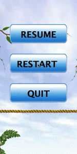

# A Game Written in JAVA

Rui Wang @ Tsinghua University

## Demo

(To watch the full demo, please visit its [GitHub page](https://github.com/ArayCHN/Bubble_game))

## Usage

The game is composed of three main pages. The index page, the game page, and the resume page.

The index page is where a user can select levels and custom difficulty according to a `.txt` file. Users can also quit the game from this page.

The game page is the main body of this game. There is a cannon that can shoot a ball on clicking. The next ball to be shot is placed under the cannon (half-exposed), while the next next ball is placed to the left of the cannon. There is a timer that starts at 60 seconds. The balls will bounce off if it collides with a side wall. Apart from the basic functions, the game also offers four additional tools.

* The bomb. The bomb will eliminate all balls next to it.
* The rainbow. The rainbow will randomly turn into the color of a ball next to it.
* The laser. The laser will let all balls that are not on the ceiling fall
* The gold. The gold will add 10 seconds.

The balls are eliminated if there are more than 3 of the same color connected together. If a ball is not connected to the ceiling any more after other balls eliminate, it falls to the ground.

You **win** when: the total number of balls left < 5.

You **lose** when: any ball reaches below the death line.

## Code Structure
The code can be broken into three major classes. `Index`, `GameInterface`, and `LogicGame`. `GameInterface` defines different `JPanels` within the game page including the timer, the balls, the pause button, and so on.

The major body of the program is insider `LogicGame.java`, where the game itself is implemented. Actually both the logic representation and graphics are implemented in this file. The mouse listener detects the user's input and use a different thread to render the ball launching procedure. It also determines when the balls are eliminated, fall, or the user wins or loses.

Throughout the program we use a single frame so that the window will not move by itself. The only thing we change is the `JPanel` within this frame. We DO NOT create a new frame each time the user restarts the game.

## Thoughts
The most difficult part is to let the cannon rotate with the mouse. This is hard because java does not have an embedded method for icon rotation. Therefore, I had to rotate the image first and set it as an icon. Also, special attention has to be paid in order to let the image rotate around a certain point and fix that point inside the window.